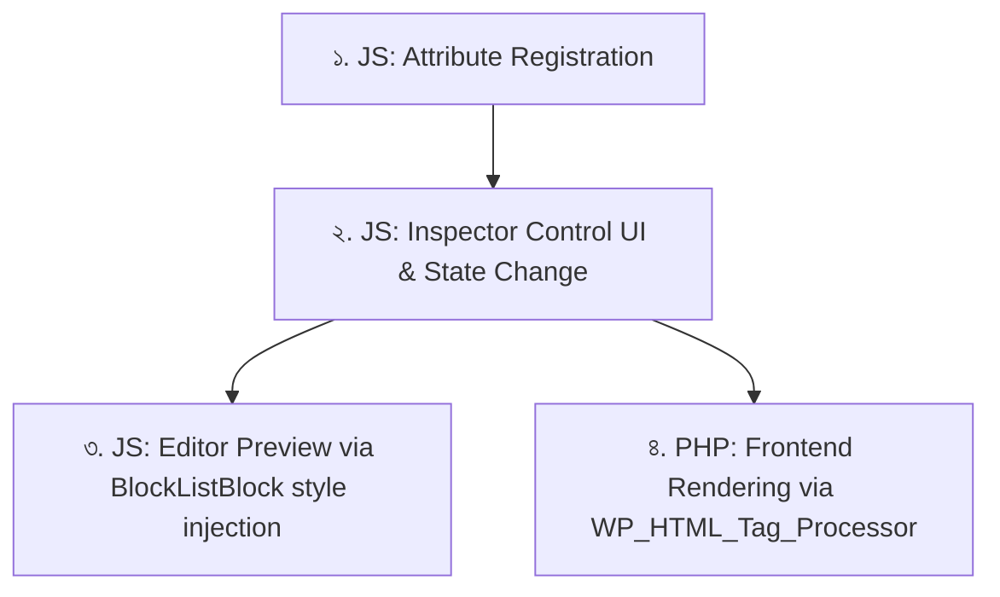

# Gutenberg Core Block Extension Guide (বাংলা ডকুমেন্টেশন)

এই ডকুমেন্টেশনে আমরা আলোচনা করব কীভাবে ওয়ার্ডপ্রেস গুটেনবার্গ (Gutenberg) এডিটর এর কোর ব্লকে কাস্টম প্যানেল/ট্যাব (Tabs) যোগ করা যায় এবং আমাদের তৈরি করা কম্পোনেন্টের ভ্যালুগুলোকে ডায়নামিক সিএসএস (CSS) এ রূপান্তর করে রেন্ডার করা যায়।

---

## ১. কোর ব্লকে কাস্টম ট্যাব বা প্যানেল গ্রুপ যোগ করার নিয়ম

ওয়ার্ডপ্রেস ৬.২+ সংস্করণে ব্লকের সেটিংস সাইডবারকে প্রধানত দুটি গ্রুপ বা ট্যাবে ভাগ করা হয়েছে:
1. **Settings Tab** (গিয়ার আইকন)
2. **Styles Tab** (কালার সার্কেল আইকন)

কোর ব্লকের এই নির্দিষ্ট ট্যাবগুলোতে আমাদের কাস্টম কন্ট্রোল যোগ করার জন্য আমরা `<InspectorControls>` এর `group` প্রপার্টি ব্যবহার করতে পারি।

### কোড উদাহরণ (JSX):

```jsx
import { InspectorControls } from '@wordpress/block-editor';
import { PanelBody, ToggleControl } from '@wordpress/components';

function MyCustomBlockExtension( props ) {
    return (
        <>
            {/* ১. কন্ট্রোলগুলো সরাসরি 'Styles' ট্যাবে দেখানোর জন্য: group="styles" */}
            <InspectorControls group="styles">
                <PanelBody title="Custom Text Shadow">
                    {/* এখানে আপনার কন্ট্রোল থাকবে */}
                </PanelBody>
            </InspectorControls>

            {/* ২. কন্ট্রোলগুলো এডিটরের ডিফল্ট 'Settings' ট্যাবে দেখানোর জন্য: group="settings" */}
            <InspectorControls group="settings">
                <PanelBody title="Custom Settings">
                    {/* এখানে আপনার কন্ট্রোল থাকবে */}
                </PanelBody>
            </InspectorControls>
        </>
    );
}
```

> [!NOTE]
> `group` প্রোপ ব্যবহার করলে গুটেনবার্গ নিজে থেকেই ওই কন্ট্রোলগুলোকে সঠিক ট্যাবের নিচে সাজিয়ে নেয়। কোনো গ্রুপ নির্ধারণ না করলে সেটি ডিফল্টভাবে প্রধান সেটিংসে দেখায়।

---

## ২. কম্পোনেন্টের ভ্যালু থেকে ডায়নামিক সিএসএস যোগ করার লাইফসাইকেল

কম্পোনেন্টের ভ্যালু ডেটাবেজে সংরক্ষণ করা থেকে শুরু করে এডিটর এবং ফ্রন্টএন্ডে সিএসএস জেনারেট করার প্রক্রিয়াটি ৪টি ধাপে সম্পন্ন হয়:



### ধাপ ১: নতুন অ্যাট্রিবিউট রেজিস্টার করা (জাভাস্ক্রিপ্ট)
গুটেনবার্গকে জানাতে হবে যে আমরা ব্লকের ডেটা সংরক্ষণের জন্য একটি কাস্টম অ্যাট্রিবিউট ব্যবহার করছি।

```javascript
import { addFilter } from '@wordpress/hooks';

function registerAttributes( settings, name ) {
    if ( name !== 'core/paragraph' ) return settings;

    return {
        ...settings,
        attributes: {
            ...settings.attributes,
            textShadow: {
                type: 'array',
                default: []
            }
        }
    };
}
addFilter( 'blocks.registerBlockType', 'my-plugin/register-attrs', registerAttributes );
```

### ধাপ ২: এডিটরে স্টেট আপডেট ও কন্ট্রোল বাইন্ডিং
ইউজার যখন কন্ট্রোল এডিট করবে, তখন `setAttributes` দিয়ে অ্যাট্রিবিউটটি আপডেট করা হয়।

```jsx
// ShadowControl থেকে ডেটা আপডেট করার ফ্লো:
<ShadowControl
    value={ attributes.textShadow }
    onChange={ ( newShadowArray ) => setAttributes({ textShadow: newShadowArray }) }
/>
```

### ধাপ ৩: এডিটরের ভেতরে লাইভ সিএসএস রেন্ডারিং (Live Preview)
ইউজার যেন পরিবর্তনটি এডিটরে দেখতে পায়, তার জন্য `editor.BlockListBlock` ফিল্টার দিয়ে এডিটরের র‍্যাপারে ডায়নামিক ইনলাইন স্টাইল পুশ করা হয়।

```jsx
import { createHigherOrderComponent } from '@wordpress/compose';

const withLiveCssInEditor = createHigherOrderComponent( ( BlockListBlock ) => {
    return ( props ) => {
        if ( props.name !== 'core/paragraph' ) return <BlockListBlock { ...props } />;

        const { textShadow } = props.attributes;

        if ( textShadow && textShadow.length ) {
            // ১. অ্যারে থেকে সিএসএস স্ট্রিং জেনারেট করা
            const shadowCss = textShadow.map( s => `${s.hOffset} ${s.vOffset} ${s.blur} ${s.color}` ).join(', ');

            // ২. এডিটর র‍্যাপারের style অবজেক্টে ইনলাইন স্টাইল যুক্ত করা
            const wrapperProps = {
                ...props.wrapperProps,
                style: {
                    ...props.wrapperProps?.style,
                    textShadow: shadowCss
                }
            };

            return <BlockListBlock { ...props } wrapperProps={ wrapperProps } />;
        }

        return <BlockListBlock { ...props } />;
    };
}, 'withLiveCssInEditor' );

addFilter( 'editor.BlockListBlock', 'my-plugin/add-live-css', withLiveCssInEditor );
```

### ধাপ ৪: ফ্রন্টএন্ডে ডায়নামিক সিএসএস রেন্ডারিং (PHP)
পোস্টটি যখন ভিজিটররা ওয়েবসাইটে দেখবে, তখন পিএইচপি ফিল্টারের মাধ্যমে আমরা অ্যাট্রিবিউটের অ্যারে ডেটা থেকে সিএসএস জেনারেট করে `<p>` ট্যাগের স্টাইল ও ক্লাস আপডেট করব।

```php
function add_frontend_css_style( $block_content, $block ) {
    // ১. চেক করা যে এটি আমাদের কাঙ্ক্ষিত ব্লক এবং অ্যাট্রিবিউট আছে কিনা
    if ( isset( $block['attrs']['textShadow'] ) && ! empty( $block['attrs']['textShadow'] ) ) {
        
        // ২. সিএসএস স্ট্রিং জেনারেট করা
        $rules = array();
        foreach ( $block['attrs']['textShadow'] as $layer ) {
            $rules[] = sprintf(
                '%s %s %s %s',
                $layer['hOffset'] ?: '0px',
                $layer['vOffset'] ?: '0px',
                $layer['blur'] ?: '0px',
                $layer['color'] ?: '#7090b0'
            );
        }
        $css_value = implode( ', ', $rules );

        // ৩. WP_HTML_Tag_Processor দিয়ে প্যারাগ্রাফ ট্যাগে ক্লাস ও ইনলাইন স্টাইল বসানো
        if ( class_exists( 'WP_HTML_Tag_Processor' ) ) {
            $tags = new WP_HTML_Tag_Processor( $block_content );
            if ( $tags->next_tag( array( 'tag_name' => 'p' ) ) ) {
                // ক্লাস অ্যাড করা
                $tags->add_class( 'has-text-shadow' );
                
                // ইনলাইন স্টাইল যোগ করা
                $existing_style = $tags->get_attribute( 'style' );
                $new_style = 'text-shadow: ' . $css_value . ';' . ( $existing_style ? ' ' . $existing_style : '' );
                $tags->set_attribute( 'style', $new_style );
            }
            $block_content = $tags->get_updated_html();
        }
    }
    return $block_content;
}
add_filter( 'render_block_core/paragraph', 'add_frontend_css_style', 10, 2 );
```

---

## কেন আমরা ইনলাইন সিএসএস (Inline CSS) রেন্ডার করছি?

১. **জিরো ভ্যালিডেশন এরর (No Block Validation Errors)**: গুটেনবার্গের সেভ ফাইলে কাস্টম মার্কআপ সেভ না করে ডায়নামিক রেন্ডারিং করলে পরবর্তীতে প্লাগিন নিষ্ক্রিয় করলেও ডাটাবেজের কনটেন্ট অক্ষত থাকে।
২. **থিম সাপোর্ট**: থিমের যেকোনো ডিফল্ট স্টাইলকে ইনলাইন সিএসএস ওভাররাইড করতে পারে।
৩. **অসীমত কাস্টমাইজেশন**: ইউজার এডিটরে যতগুলো খুশি শ্যাডো লেয়ার তৈরি করুক না কেন, তা ডাইনামিকালি ব্রাউজারে জেনারেট হয়ে যাবে।
